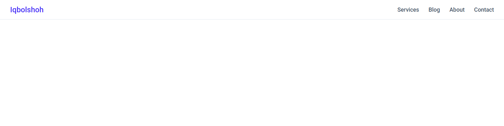
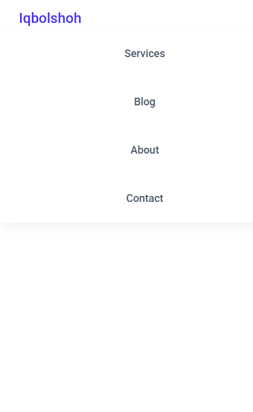

# 📱 JavaScript Mobile Menu

**JavaScript Mobile Menu** is a **lightweight, responsive navigation bar component** built with **vanilla HTML, CSS, and JavaScript**. It shows a full horizontal menu on desktop and collapses into an animated hamburger toggle on smaller screens — a clean, dependency-free starting point for any website header.

<p align="left">
  
  
  
  
</p>

## 📚 Table of Contents

- [Features](#-features)
- [Preview](#-preview)
- [Project Structure](#-project-structure)
- [Installation Guide](#️-installation-guide)
- [Usage](#-usage)
- [Technologies Used](#-technologies-used)
- [License](#-license)
- [Contributing](#-contributing)
- [Connect with Me](#-connect-with-me)

## ✨ Features

✅ **Responsive navigation:** Full inline menu on desktop, collapsible drawer on mobile.
✅ **Animated hamburger icon:** The three lines morph into an X when the menu opens.
✅ **Smooth transitions:** CSS-based slide-in animation for the mobile menu panel.
✅ **Zero dependencies:** Pure HTML, CSS, and JavaScript — no frameworks required.
✅ **Easy to customize:** Simple markup and class names make styling and re-theming quick.

## 👀 Preview

### 💻 Desktop


### 📱 Mobile


## 📂 Project Structure

```
javascript-mobile-menu/
├── src/
│   ├── css/
│   │   └── style.css        # Navbar layout, responsive breakpoints, and menu animation
│   ├── js/
│   │   └── script.js        # Hamburger toggle logic
│   └── images/                # Screenshots used in this README
├── favicon.ico
├── index.html                  # Navbar markup
└── README.md
```

## ⚙️ Installation Guide 🛠️

### 1️⃣ Clone the Repository 📥
```bash
git clone https://github.com/Iqbolshoh/javascript-mobile-menu.git
```

### 2️⃣ Navigate to the Project Directory 📂
```bash
cd javascript-mobile-menu
```

### 3️⃣ Open the App 🌐
Just open `index.html` in any modern browser — no build step or server required.

## 🚀 Usage

1. ✏️ **Edit menu links:** Update the `<ul class="nav-menu">` list in `index.html` to add or remove navigation items.
2. 🎨 **Restyle:** Adjust `src/css/style.css` to change colors, spacing, or the mobile breakpoint (`@media (max-width: 768px)`).
3. ⚙️ **Behavior:** `src/js/script.js` toggles the `.active` class on the hamburger icon and menu — extend it if you need extra interactivity (e.g. closing on link click).

## 🖥 Technologies Used


## 📜 License
This project is open-source and available under the [MIT License](./LICENSE).

## 🤝 Contributing
🎯 Contributions are welcome! If you have suggestions or want to enhance the project, feel free to fork the repository and submit a pull request.

## 📬 Connect with Me
💬 I love meeting new people and discussing tech, business, and creative ideas. Let's connect! You can reach me on these platforms:

<div align="center">

[](https://iqbolshoh.uz)
[](mailto:iilhomjonov777@gmail.com)
[](https://github.com/iqbolshoh)
[](https://t.me/templates_uz_support)
[](https://wa.me/998776030033)
[](https://instagram.com/iqbolshoh.dev)
[](https://www.youtube.com/@Iqbolshoh_dev)

</div>
